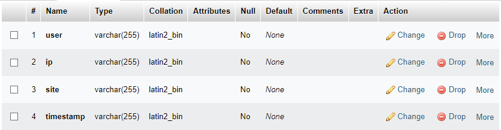

# Project Name

## Overview

This project provides an API that verifies if a user has voted for your server on the websites [serveur-prive.net](https://www.serveur-prive.net) and [minecraft-mp.com](https://minecraft-mp.com). The API can be integrated into your server to reward players who vote.

## How to Setup

### Configuration

1. **API Tokens**:  
   - Open the `config` file.
   - Insert your API tokens for `serveur-prive.net` and/or `minecraft-mp.com`.  
   - If you’re not using a specific vote site, you can leave the corresponding token field empty.

2. **Database Configuration**:  
   - In the `config` file, also include your MySQL database information:
     - `host`: Your MySQL host (e.g., `localhost`).
     - `user`: Your MySQL username.
     - `password`: Your MySQL password.
     - `database`: The name of your database.
   - The name of the table have to be `votes`. Ensure your table matches the structure shown in the screenshot: .
   - Alternatively, you can use the SQL script provided in the `installation` folder to set up your table automatically.

## Running the Project

- To install all Node.js packages run `npm install`
- To start the API, run the following command: `node index.js`
- By default, the API runs on port 3000. You can change this port in the `index.js` file if needed.

1. **Example Usage**:  

   To use the API, you can send a POST request with the following code:

   ```javascript
   const data = {
      site: "serveur-prive", // can be "serveur-prive" or "minecraft-mp"
      ip: "125.88.255.158", // IP address of the voter
      username: "Mrjango90", // Username of the voter
   };

   const response = await fetch('http://localhost:3000/control/vote', { // Link to your API
      method: 'POST',
      headers: {
         'Content-Type': 'application/json',
      },
      body: JSON.stringify(data),
   });

   console.log(await response.json()); // Result

2. **API Responses**
   The API responds with a JSON object containing two fields:
   - `status`: Indicates the result of the vote check.
   - `0`: User has not voted.
   - `1`: Vote claimed.
   - `2`: Vote already claimed.
   - `message`: Provides additional information about the result.

## Requirements

This project requires the following Node.js packages:

- `axios`: ^1.7.3
- `express`: ^4.19.2
- `mysql`: ^2.18.1

## Contact

For any questions, support, or if you need help with adding vote sites or resolving bugs, please contact me through the following Discord server: [https://discord.gg/VTghdnyRvx](https://discord.gg/VTghdnyRvx). 

The server is in French, but I can assist in English as well. Feel free to reach out!

